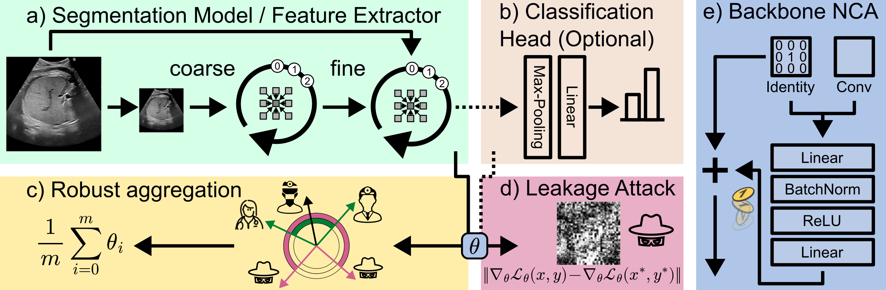

# FedNCA - FedNCA enables Democratic Medical AI
This is the official implementation of our paper **FedNCA enables Democratic Medical AI** submitted to the IEEE Transactions on Medical Imaging journal.  
Mirko Konstantin<sup>\*</sup>, Nick Lemke<sup>\*</sup>, John Kalkhof, Henry John Krumb, Jonathan Stieber, Marco Lorenzi, Anirban Mukhopadhyay  
<sup>\*</sup> Equal Contribution



## Installation
1. Setup a conda environment with ``conda create -n <your_conda_env> python=3.10``. 
2. Install torch with your preferred CUDA version, e.g. ``pip3 install torch torchvision torchaudio --index-url https://download.pytorch.org/whl/cu118``.
3. Install other dependencies via ``pip install -r requirements.txt``.
4. (Optional) Log into wandb via ``wandb login``.
5. Specify paths in [utils/root_path.py](utils/root_path.py).


### Dataset Download
The datasets used in our publication can be downloaded from the following sources:

| Anatomy | Dataset | Link |
|-|-|-|
|Pathology|CRC|https://zenodo.org/records/1214456|
|Ultrasound|Fetal Abdominal Structures Segmentation|https://data.mendeley.com/datasets/4gcpm9dsc3/1|
|XRay|MIMIC-III|https://physionet.org/content/mimic-cxr/2.1.0/ https://physionet.org/content/chexmask-cxr-segmentation-data/1.0.0/|

The Pathology and Ultrasound datasets do not need further processing. Instead, rescaling and normalization are performed by the data loader on the fly. 
After downloading the segmentation masks from [MIMIC-CXR](https://physionet.org/content/mimic-cxr/2.1.0/) amd the segmentation masks from [CheXmask-CXR](https://physionet.org/content/chexmask-cxr-segmentation-data/1.0.0/), prepare the data using [`prepare_mimic.py`](./prepare_mimic.py). After that, further preprocess it to PNGs using [`process_mimic.py`](./process_mimic.py).


## Usage
### Training
Training can be started using [`train_fed.py`](./train_fed.py). This script also contains all the parameters that you can specify.
<details>
  <summary>Click here for a list of the commands to reproduce our experiments and accompanying explanations for running experiments.</summary>

#### Quantitative results (Figure 3)
Segmentation: To reproduce the segmentation results run the following commands.
```
python train_fed.py --data fetalAbdominal --model new_mednca
python train_fed.py --data fetalAbdominal --model new_mednca --apply_homomorphic_encryption
python train_fed.py --data fetalAbdominal --model unet
python train_fed.py --data fetalAbdominal --model unet --quantize_mode float4
python train_fed.py --data fetalAbdominal --model unet --sparsification_mode top-k --sparsification_parameter 0.25
python train_fed.py --data fetalAbdominal --model unet --sparsification_mode top-k --sparsification_parameter 0.01
```
For training the other baselines, you need to change the `--model` parameter to `transunet_b16` and `segformer`. Similarly, to perform experiments on the XRay or histopathology data, change the `--data` parameter to `XRayMimic200` or `crc`, respectively. The baseline models for the histopathology training are found under the `--model` keys `vit4sgd` and `densenet`, our FedNCA model is specified by the argument `maxmednca_nobn`.

If the experiment has already been evaluated, the script will ask if you want to retrain and delete the previous evaluation results. If you're going to programatically start experiments without, you can specify the parameter `--no_rerun`. This parameter will not ask for a retraining, but instead terminate the training before deleting the previous results.

You can also track experiments using the `--enable_wandb` parameter, which will make every client start a [Weights & Biases](https://wandb.ai/) session and report results there. In the W&B interface, make sure to activate grouping in the top-right, as the logs can be confusing otherwise.


#### Robustness Towards Malfunctioning Clients (Figure 5)
The experiments on robustness can be run using those arguments. Additionally, you must modify the `--data` and `--model` parameters as above to generate the additional results.
```
python train_fed.py --data fetalAbdominal --model new_mednca --algorithm ASMR --malf ana --malfclients 1 --malf_prob 1
python train_fed.py --data fetalAbdominal --model new_mednca --algorithm FedAvg --malf ana --malfclients 1 --malf_prob 1
python train_fed.py --data fetalAbdominal --model new_mednca --algorithm ASMR --malf ana --malfclients 1 --malfclients 2 --malf_prob 1
python train_fed.py --data fetalAbdominal --model new_mednca --algorithm FedAvg --malf ana --malfclients 1 --malfclients 2 --malf_prob 1
```

</details>

### Evaluation
Evaluation is done using the [`eval.py`](./eval.py) script. Select the correct experiment by specifying the same parameters as in the specific training run. For example, the experiments carried out earlier are evaluated with the following commands.
```
python eval.py --data fetalAbdominal --model new_mednca
python eval.py --data fetalAbdominal --model new_mednca --apply_homomorphic_encryption
python eval.py --data fetalAbdominal --model unet
python eval.py --data fetalAbdominal --model unet --quantize_mode float4
python eval.py --data fetalAbdominal --model unet --sparsification_mode top-k --sparsification_parameter 0.25
python eval.py --data fetalAbdominal --model unet --sparsification_mode top-k --sparsification_parameter 0.01
```

### Gradient Leakage
The gradient leakage is performed using the [reconstruction.py](./reconstruction.py) script for each case separately. For example:
```
python reconstruction.py --dataset crc --case_name LYM/LYM-YHVTSACV --model maxmednca_nobn --known_label False --distance_name l2_normalized --no_rerun
```
The gradient leakage experiments can be easily started using the [run_all_reconstructions_crc.py](./run_all_reconstructions_crc.py).
Similar scripts exist for the other datasets.

## Reproduce Figures and Tables
**Figures**
Figure Idx | Script | Contents | Notes
-|-|-|-|
3| [`train_results.ipynb`](./analysis/train_results.ipynb) | Dice scores & Transmission cost | For training see [Usage/Training](#training)
4| [`analyse_reconstructions.ipynb`](analyse_reconstructions.ipynb) | Gradient leakage attacks | See [Usage/Gradient Leakage](#gradient-leakage)
5, C.7, C.8, C.9| [`reconstructions_qualitative.ipynb`](analysis/reconstructions_qualitative.ipynb) | Qualitative reconstruction attacks | 
6| [`malf_results2.ipynb`](analysis/malf_results2.ipynb) | Malfunctioning attacks | For training see [Usage/Training](#training)
D.10, D.11, D.12| [`convergence.ipynb`](analysis/convergence.ipynb) | Convergence curves | 

**Tables**
Table Idx | Script | Contents | Notes
-|-|-|-|
2| [`model_stats.ipynb`](analysis/model_stats.ipynb) | Model measurements | Use [`measure_model.py`](./measure_model.py) and [run_all_measure_model.ipynb](./run_all_measure_model.ipynb)
B.3, B.4, B.5| [`analyse_reconstructions.ipynb`](analyse_reconstructions.ipynb) | Gradient leakage attacks |


# Citing FedNCA
If you use FedNCA in your research, please include the following BibTeX entry.
```
TODO
```
